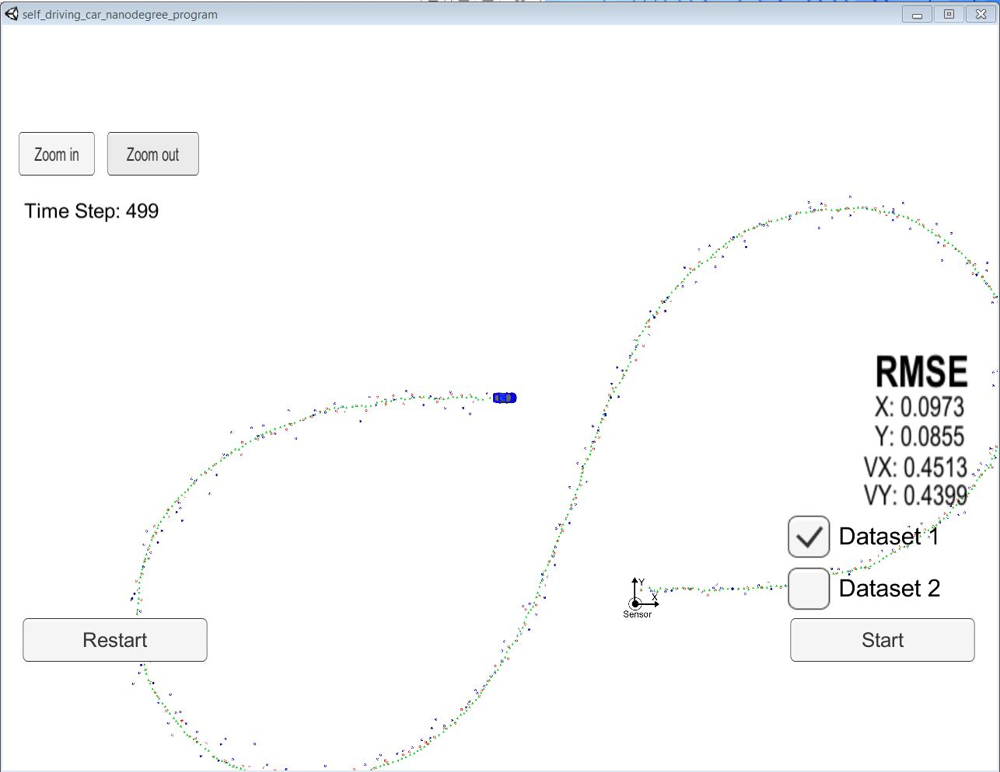

# Extended Kalman Filter Project
Self-Driving Car Engineer Nanodegree Program

In this project I utilize a kalman filter to estimate the state of a moving object of interest with noisy lidar and radar measurements.

My setup is done using windows with docker installed. The remaining setup was done as a linux system.

The programs that were be written to accomplish the project are src/FusionEKF.cpp, src/FusionEKF.h, kalman_filter.cpp, kalman_filter.h, tools.cpp, and tools.h

Following changes were done in the files.
### `src/FusionEKF.cpp`
1. Finished initializing the FusionEKF by setting up process and measurement noises, laser and radar update matrices.
2. Converted radar measurements from polar to cartesian coordinates and initialize state.
3. Initialize state with x, y positions from measurements and velocity as 0 if initialize state is using laser.
4. Update the process noise covariance matrix dervied by considering uncertainity due to acceleration. noise_ax = 9 and noise_ay = 9 was chosen.
5. Obtain delta t and update the F matrix with the delta t for velocity terms. 
6. Used the sensor type to perform the update step. 
7. If the sensor was laser, update is done as a linear ekf using `ekf_.Update()` and constant H and R matrices are used. 
8. If the sensor is radar, update H matrix by calcualting jacobina matrix using `tools.CalculateJacobian()` and use as measurement update matrix. Update measurement using using `ekf_.UpdateEKF()`

### `src/kalman_filter.cpp`
1. Implemented equations to predict the state. 
2. Implemented `update()` the state by using Kalman Filter equations for linear update.
3. Implemented `UpdateEKF()`. First ro, theta and ro dot are obtained using the non linear equations. Then y is obtained and theta in y is normalized between pi and -pi. Then standard Kalman Filter equations are used.

### `src/tools.cpp`
1. Implemented function to calculate the RMSE
2. Implemented function to calculate a Jacobian.

## Project Instructions and Rubric

1. The code compiles using the standard method of executing command `cmake .. && make` from the folder `build`. After successful compilation run `./ExtendedKF` to start the executable.
2. After attaching to simulator and running against Dataset 1 in the simulator the RMSE for all states are found within acceptable limits. The results after the run is complete are shown in the following image.

3. The algorithm follows the standard procedure of running the kalman filter. 
	1. Uses  first measurements to initialize the state vectors and covariance matrices.
	2. Then the algorithm predicts object position to the current timestep and then update the prediction using the new measurement.
	3. Algorithm sets up the appropriate matrices given the type of measurement and calls the correct measurement function for a given sensor type.
 
4. In the code there is no manner when previous information is stored, neither loops are implemented. The implementation is done by the books and kept straight forward.